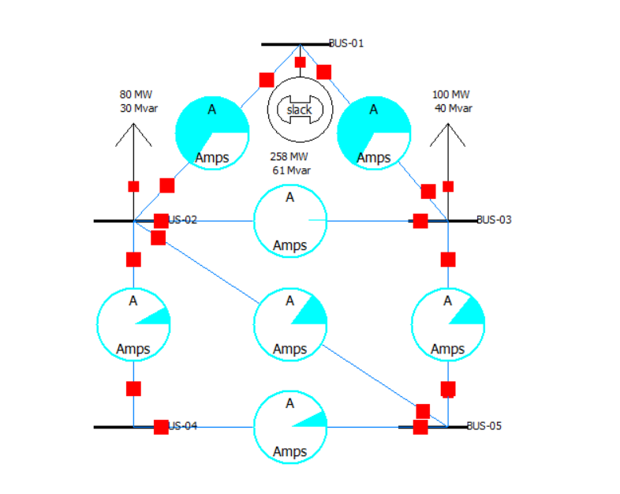
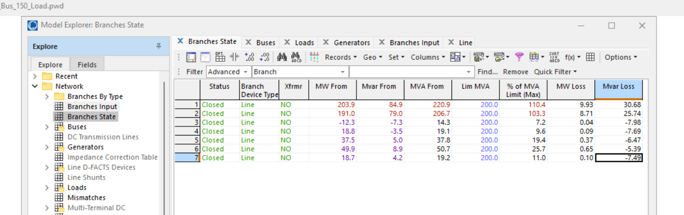
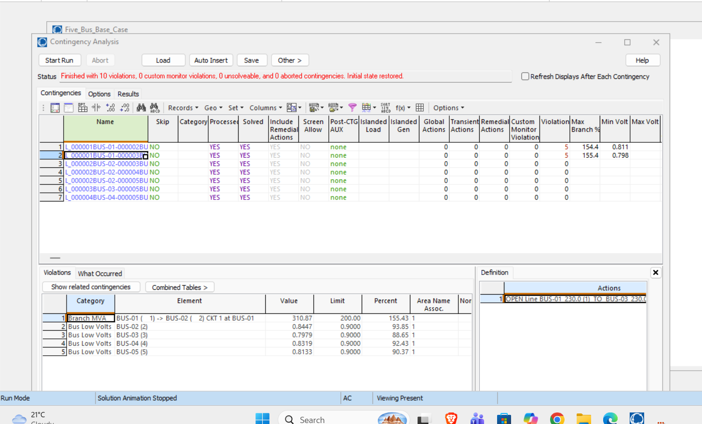
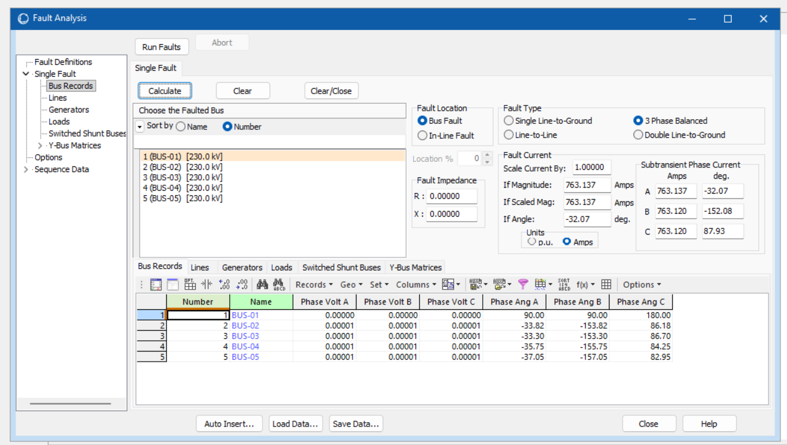

# Power System Load Flow, Contingency & Short-Circuit Analysis

A 5-bus, 230 kV power-system study developed in **PowerWorld Simulator** to analyze system behaviour under normal loading, increased demand, N-1 transmission-line outages, and electrical faults.

This project evaluates how system loading and network changes affect:

- Bus voltage
- Voltage angle
- Transmission-line loading
- Generator output
- Real-power losses
- N-1 security
- Short-circuit current

---

## Project Overview

The system was modeled as a small meshed transmission network with:

- 5 buses
- 7 transmission lines
- 1 generator
- 3 loads
- 230 kV nominal system voltage
- 200 MVA transmission-line ratings

The model was built to support load-flow, contingency, and fault studies within the same PowerWorld case.

---

## System Topology

```text
                    Generator
                        |
                     BUS-01
                    /      \
                   /        \
              BUS-02 ------ BUS-03
                |  \          |
                |    \        |
                |      \      |
              BUS-04 ------ BUS-05
```

### Transmission Lines

The network contains:

```text
BUS-01 → BUS-02
BUS-01 → BUS-03
BUS-02 → BUS-03
BUS-02 → BUS-04
BUS-02 → BUS-05
BUS-03 → BUS-05
BUS-04 → BUS-05
```

All transmission lines were assigned:

| Parameter | Value |
|---|---:|
| Resistance, R | 0.02 pu |
| Reactance, X | 0.08 pu |
| Charging, B | 0.10 pu |
| Rating | 200 MVA |

---

## Base Load

The normal 100% loading condition was:

| Bus | Real Power | Reactive Power |
|---|---:|---:|
| BUS-02 | 80 MW | 30 Mvar |
| BUS-03 | 100 MW | 40 Mvar |
| BUS-05 | 70 MW | 25 Mvar |
| **Total** | **250 MW** | **95 Mvar** |

BUS-01 was configured as the slack/reference bus and contained the main generator.

---

## Software Used

- **PowerWorld Simulator** — power-flow, contingency, and fault analysis
- **Google Sheets / Microsoft Excel** — calculations, tables, and graphs
- **GitHub** — project documentation and file organization

---

# 1. Base-Case Load Flow

The first study evaluated the network under normal **100% loading**.

The power-flow solution converged successfully.

## Bus Results

| Bus | Voltage (pu) | Voltage (kV) | Angle |
|---|---:|---:|---:|
| BUS-01 | 1.00000 | 230.000 | 0.00° |
| BUS-02 | 0.95243 | 219.058 | -5.78° |
| BUS-03 | 0.94861 | 218.181 | -5.80° |
| BUS-04 | 0.95106 | 218.745 | -6.54° |
| BUS-05 | 0.94224 | 216.714 | -7.18° |

## Base-Case Summary

| Result | Value |
|---|---:|
| Total Load | 250 MW |
| Reactive Load | 95 Mvar |
| Generator Output | 257.61 MW |
| Generator Reactive Output | 61.42 Mvar |
| Real-Power Loss | 7.61 MW |
| Real-Power Loss Percentage | 2.95% |
| Lowest Bus Voltage | 0.94224 pu |
| Lowest-Voltage Bus | BUS-05 |
| Highest Line Loading | 66.7% |
| Most Heavily Loaded Line | BUS-01 → BUS-03 |

The base case operated without transmission-line overloads.

The main issue visible in the normal operating case was the voltage drop at buses located farther from the generator.



---

# 2. Heavy-Load Analysis

The next study examined the effect of increasing demand while keeping the transmission network unchanged.

Three loading levels were compared:

- 100%
- 125%
- 150%

---

## 125% Load Case

The loads were increased to:

| Bus | Real Power | Reactive Power |
|---|---:|---:|
| BUS-02 | 100 MW | 37.50 Mvar |
| BUS-03 | 125 MW | 50.00 Mvar |
| BUS-05 | 87.5 MW | 31.25 Mvar |
| **Total** | **312.5 MW** | **118.75 Mvar** |

### Results

| Result | Value |
|---|---:|
| Generator Output | 325.25 MW |
| Generator Reactive Output | 108.50 Mvar |
| Real-Power Loss | 12.75 MW |
| Lowest Voltage | 0.91489 pu |
| Lowest-Voltage Bus | BUS-05 |
| Highest Line Loading | 86.4% |
| Most Heavily Loaded Line | BUS-01 → BUS-03 |

The system still solved successfully, but transmission loading and voltage conditions moved closer to the model's operating limits.

---

## 150% Load Case

The loads were increased again to:

| Bus | Real Power | Reactive Power |
|---|---:|---:|
| BUS-02 | 120 MW | 45 Mvar |
| BUS-03 | 150 MW | 60 Mvar |
| BUS-05 | 105 MW | 37.5 Mvar |
| **Total** | **375 MW** | **142.5 Mvar** |

### Results

| Result | Value |
|---|---:|
| Generator Output | 394.88 MW |
| Generator Reactive Output | 163.89 Mvar |
| Real-Power Loss | 19.88 MW |
| Lowest Voltage | 0.88326 pu |
| Lowest-Voltage Bus | BUS-05 |
| Highest Line Loading | 110.4% |

Two transmission lines exceeded their 200 MVA ratings:

| Line | Loading |
|---|---:|
| BUS-01 → BUS-02 | 110.4% |
| BUS-01 → BUS-03 | 103.3% |

The 150% case produced clear thermal and low-voltage problems.



---

# 3. Load Study Comparison

| Scenario | Total Load | Generator Output | System Loss | Lowest Voltage | Highest Line Loading |
|---|---:|---:|---:|---:|---:|
| 100% Base | 250 MW | 257.61 MW | 7.61 MW | 0.94224 pu | 66.7% |
| 125% Load | 312.5 MW | 325.25 MW | 12.75 MW | 0.91489 pu | 86.4% |
| 150% Load | 375 MW | 394.88 MW | 19.88 MW | 0.88326 pu | 110.4% |

The load-study results show a clear pattern:

```text
Higher system load
        ↓
Lower bus voltage
        ↓
Higher transmission-line loading
        ↓
Higher generator output
        ↓
Higher real-power losses
        ↓
Operating limits eventually exceeded
```

---

# 4. Minimum Bus Voltage vs System Load


The minimum bus voltage decreased from:

- **0.94224 pu** at 100% load
- **0.91489 pu** at 125% load
- **0.88326 pu** at 150% load

BUS-05 was the lowest-voltage bus in all three load cases.

The results show that increasing demand weakened the system voltage profile.

---

# 5. Maximum Transmission-Line Loading vs System Load


Maximum line loading increased from:

- **66.7%** at 100% load
- **86.4%** at 125% load
- **110.4%** at 150% load

At 150% loading, the system exceeded the assigned transmission-line rating.

The two main lines connected to BUS-01 became the limiting transmission paths.

---

# 6. Real-Power Losses vs System Load


Real-power losses increased from:

- **7.61 MW** at 100% load
- **12.75 MW** at 125% load
- **19.88 MW** at 150% load

The increase in losses became larger as network loading increased.

This occurs because transmission losses depend strongly on line current.

---

# 7. N-1 Contingency Analysis

An N-1 contingency study was performed on all seven transmission lines.

The purpose was to determine if the network could continue operating acceptably after the loss of one transmission element.

PowerWorld defines N-1 analysis around the idea that a system should remain secure following the loss of a single transmission or generation element.

Seven line-outage contingencies were tested.

## Contingency Results

| Line Outage | Violations | Maximum Line Loading | Minimum Voltage |
|---|---:|---:|---:|
| BUS-01 → BUS-02 | 5 | 154.4% | 0.811 pu |
| BUS-01 → BUS-03 | 5 | 155.4% | 0.798 pu |
| BUS-02 → BUS-03 | 0 | — | — |
| BUS-02 → BUS-04 | 0 | — | — |
| BUS-02 → BUS-05 | 0 | — | — |
| BUS-03 → BUS-05 | 0 | — | — |
| BUS-04 → BUS-05 | 0 | — | — |

All seven contingencies solved successfully.

Five outages produced no reported violations.

Two outages produced severe problems:

- BUS-01 → BUS-02
- BUS-01 → BUS-03

---

## BUS-01 → BUS-02 Outage

Removing the BUS-01 → BUS-02 line forced much of the system power through the remaining BUS-01 → BUS-03 transmission path.

### Results

| Result | Value |
|---|---:|
| Remaining Main-Line Flow | 308.84 MVA |
| Remaining Main-Line Loading | 154.42% |
| BUS-02 Voltage | 0.8105 pu |
| BUS-03 Voltage | 0.8470 pu |
| BUS-04 Voltage | 0.8147 pu |
| BUS-05 Voltage | 0.8124 pu |

This contingency produced:

- 1 branch overload
- 4 low-voltage violations
- 5 violations total

---

## Worst Contingency — BUS-01 → BUS-03 Outage

The most severe outage was the loss of BUS-01 → BUS-03.

### Results

| Result | Value |
|---|---:|
| Remaining Main-Line Flow | 310.87 MVA |
| Remaining Main-Line Loading | 155.43% |
| BUS-02 Voltage | 0.8447 pu |
| BUS-03 Voltage | 0.7979 pu |
| BUS-04 Voltage | 0.8319 pu |
| BUS-05 Voltage | 0.8133 pu |

This outage resulted in:

- **155.43% maximum line loading**
- **0.7979 pu minimum voltage**
- **1 branch overload**
- **4 low-voltage violations**
- **5 total violations**

The system therefore did not satisfy the N-1 criterion for loss of either main BUS-01 transmission path.



---

# 8. Short-Circuit Analysis

Fault studies were performed at all five buses.

Four fault types were studied:

- Three-phase balanced fault
- Single line-to-ground fault
- Line-to-line fault
- Double line-to-ground fault

All faults used:

```text
Fault Resistance = 0
Fault Reactance = 0
```

This represents a solid bus fault in the model.

---

## Fault-Current Results

| Bus | 3-Phase Fault | Line-to-Ground | Line-to-Line | Double Line-to-Ground |
|---|---:|---:|---:|---:|
| BUS-01 | 763.137 A | 175.026 A | 660.896 A | 94.371 A |
| BUS-02 | 720.821 A | 144.713 A | 624.249 A | 76.907 A |
| BUS-03 | 723.617 A | 146.089 A | 626.671 A | 77.643 A |
| BUS-04 | 663.279 A | 135.222 A | 574.416 A | 72.403 A |
| BUS-05 | 695.989 A | 137.634 A | 602.744 A | 73.150 A |

BUS-01 produced the highest calculated fault current for every fault category.

The largest calculated current was:

```text
BUS-01
3-Phase Balanced Fault
763.137 A
```



---

# 9. Fault Current Comparison


The 3-phase balanced fault produced the largest current at every bus.

The line-to-line fault produced the second-highest current.

Fault-current levels were generally lower at buses farther from the generator because additional network impedance reduced the available fault current.

---

# Fault-Study Limitation

The short-circuit section is a simplified educational study.

Detailed generator subtransient impedances and complete positive-, negative-, and zero-sequence parameters were not independently developed for every component.

PowerWorld fault analysis relies on sequence-specific data for detailed short-circuit calculations. If dedicated fault information is not available, PowerWorld can use load-flow data as default values for the analysis.

Because of this, the fault-current values in this project should be interpreted as comparative simulation results rather than utility-grade short-circuit calculations.

---

# Key Engineering Findings

## 1. Voltage Performance

The minimum bus voltage decreased as system demand increased:

```text
100% Load → 0.94224 pu
125% Load → 0.91489 pu
150% Load → 0.88326 pu
```

BUS-05 consistently experienced the lowest voltage.

---

## 2. Transmission Loading

Maximum transmission-line loading increased substantially:

```text
100% Load → 66.7%
125% Load → 86.4%
150% Load → 110.4%
```

The network developed transmission overloads at the 150% load level.

---

## 3. Real-Power Losses

System losses increased from:

```text
7.61 MW
   ↓
12.75 MW
   ↓
19.88 MW
```

This demonstrates the effect of higher current on transmission losses.

---

## 4. N-1 Reliability

The system remained acceptable for five of the seven single-line outages tested.

However, the network could not tolerate the loss of either main transmission line connected to BUS-01.

The worst contingency was:

```text
BUS-01 → BUS-03 Outage

Maximum Line Loading:
155.43%

Minimum Bus Voltage:
0.7979 pu
```

This identified the BUS-01 transmission corridor as the main reliability weakness.

---

## 5. Short-Circuit Behaviour

BUS-01 produced the highest calculated fault current for every fault category.

The largest calculated fault current was:

```text
763.137 A
```

for a three-phase balanced fault at BUS-01.

---

# Engineering Conclusion

The 5-bus transmission system operated successfully under its normal 100% loading condition.

As system demand increased, the network experienced:

- lower bus voltages
- higher transmission-line loading
- increased generator output
- larger voltage-angle differences
- higher real-power losses

At 150% loading, BUS-05 dropped to **0.88326 pu**, while two main transmission lines exceeded their assigned 200 MVA ratings.

The N-1 contingency analysis identified the two transmission lines connected directly to BUS-01 as the main reliability weakness in the system.

Loss of either line caused the remaining transmission path to operate above **150% loading** while several buses experienced severe low-voltage conditions.

The worst contingency was the BUS-01 → BUS-03 outage, which resulted in:

- **155.43% maximum line loading**
- **0.7979 pu minimum bus voltage**
- **5 total violations**

The short-circuit study compared four fault types across all five buses and identified BUS-01 as the location with the highest calculated fault-current levels.

Overall, the project demonstrates how **load-flow, contingency, and short-circuit studies can be combined to evaluate the voltage performance, thermal loading, reliability, losses, and fault behaviour of an interconnected power system**.

---

# Repository Structure

```text
Power-System-Load-Flow-Analysis/
│
├── README.md
│
├── PowerWorld/
│   ├── Five_Bus_Base_Case.pwb
│   ├── Five_Bus_125_Load.pwb
│   └── Five_Bus_150_Load.pwb
│
├── Calculations/
│   └── Five_Bus_System_Analysis.xlsx
│
├── Figures/
│   ├── Minimum_Bus_Voltage_vs_Load.png
│   ├── Maximum_Transmission_Line_Loading_vs_Load.png
│   ├── Real_Power_Losses_vs_Load.png
│   └── Fault_Current_Comparison_by_Bus.png
│
└── Results/
    ├── base-case.png
    ├── 150-percent-load.png
    ├── worst-contingency.png
    └── three-phase-fault-bus01.png
```

---

# Skills Demonstrated

- PowerWorld Simulator
- AC power-flow analysis
- Power-system modeling
- Per-unit analysis
- Bus-voltage analysis
- Voltage-angle analysis
- Real and reactive power analysis
- Transmission-line loading analysis
- Real-power loss analysis
- Heavy-load scenario testing
- N-1 contingency analysis
- Transmission-system reliability analysis
- Short-circuit analysis
- Three-phase fault analysis
- Single line-to-ground fault analysis
- Line-to-line fault analysis
- Double line-to-ground fault analysis
- Engineering-data interpretation
- Google Sheets / Microsoft Excel
- Engineering graphs
- Technical documentation
- GitHub project organization

---

# Project Files

### PowerWorld Models

- `Five_Bus_Base_Case.pwb`
- `Five_Bus_125_Load.pwb`
- `Five_Bus_150_Load.pwb`

### Analysis Workbook

- `Five_Bus_System_Analysis.xlsx`

The workbook contains:

- 100% base-case results
- 125% load results
- 150% load results
- N-1 contingency results
- Short-circuit results
- Final comparison tables
- Engineering graphs

---

# References

PowerWorld Corporation documentation was used for PowerWorld Simulator workflows and interpretation of contingency and fault-analysis tools.

- PowerWorld Simulator — Contingency Analysis
- PowerWorld Simulator — Fault Analysis
- PowerWorld Simulator — Sequence Data

PowerWorld documentation describes N-1 analysis as studying system security following a single transmission or generation outage. Detailed fault analysis uses sequence-specific generator, load, and branch data.

---

## Author

Engineering portfolio project created using **PowerWorld Simulator**, **Google Sheets / Microsoft Excel**, and **GitHub**.
